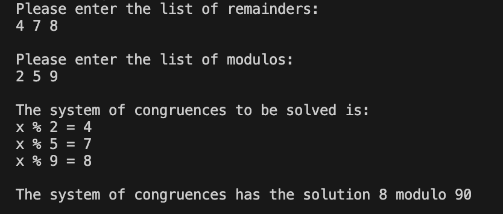

**Chinese Remainder Theorem (CRT) — Simple C++ Solver**

- **Description:** A minimal command-line program that reads three remainders and three moduli from standard input and computes a solution to the corresponding system of congruences (modulo the product of the moduli).



**Build**

The program will prompt for the three remainders, then the three moduli, e.g.:

```
Please enter the list of remainders:
2 3 2

Please enter the list of modulos:
3 5 7
```

For the example above the program prints the solution `23 modulo 105`.

**Examples**

- Example system:

- x ≡ 2 (mod 3)
- x ≡ 3 (mod 5)
- x ≡ 2 (mod 7)

- Run and enter `2 3 2` then `3 5 7`. Expected output: `The system of congruences has the solution 23 modulo 105`.
